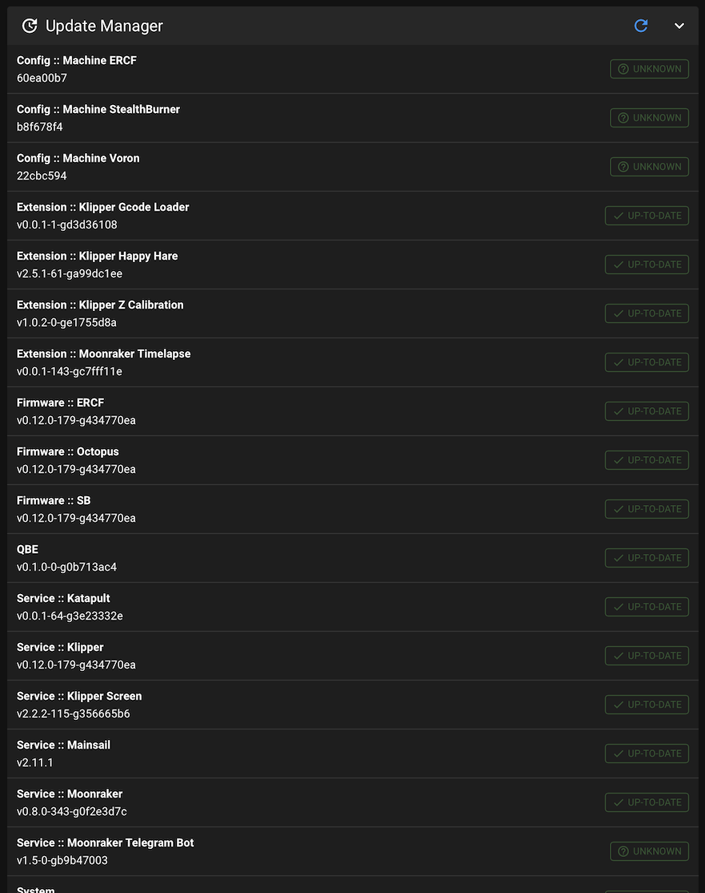

# QBE

CLI Tool and Moonraker extension (update manager compatible) to manage your 3D printer configuration extensions and services, auto-update MCUs firmware, with rich features and automated setup helpers

<details>
  <summary>Moonraker update manager extension</summary>

  
</details>

<details>
  <summary>Commandline interface</summary>

  ```
  Usage: qbe [OPTIONS] COMMAND [ARGS]...
    
  Options:
    -c, --config TEXT
    -l, --lockfile TEXT
    -h, --help           Show this message and exit.
    
  Commands:
    debug            Debug / misc stuff
    mcu-update       Update MCU Firmware
    refresh          Refresh remotes
    self-update      QBE Self Update
    status           Packages status
    update           Update dependencies
  ```
</details>

> NOTE: it assumes user has NOPASSWD sudo access at the moment

## Installation

```shell
sudo apt update
sudo apt install -y git python3-dev python3-virtualenv libffi-dev libxml2-dev libxslt-dev libsystemd-dev libssl-dev gcc rustc musl-dev

sudo groupadd qbe-manager
sudo usermod -a -G qbe-manager `whoami`
newgrp qbe-manager

sudo mkdir -p /opt /var/opt
sudo chown root:qbe-manager /opt /var/opt
sudo chmod g+w /opt /var/opt

pip install --upgrade pip

cd /opt
git clone https://github.com/vertexbz/qbe.git

cp ./qbe/qbe.template.yml ~/qbe.yml

virtualenv -p python3 /var/opt/qbe

/var/opt/qbe/bin/pip install --upgrade pip
/var/opt/qbe/bin/pip install --editable /opt/qbe
ln -sf /opt/qbe `/var/opt/qbe/bin/python -c 'import site; print(site.getsitepackages()[0])'`/qbe


sudo ln -sf /var/opt/qbe/bin/qbe /usr/local/bin/qbe
```

## Printer definition file

Before first run, update `~/qbe.yml` according to your needs.

### Packages config 

In `requires` section of `qbe.yml` file you can add packages from different sources, but every one has to include (`qbe.yml` manifest file):
- `internal` dependencies as well as 
- `git` repo links
- `local` path to local package directory

Every kind of package may take additional option that tell qbe in which flavor / with which configuration to install a package - `options` should be provided as a key-value dictionary


```yaml
requires:
  - internal: klipper # name has to match the package from ./internal-packages
  - git: https://my.git.server/owner/project.git
  - git: git@my.git.server:owner/project.git
    options:
      my_option: yellow
      other_option: magenta
  - local: /home/printer/package/my-package # local filesystem path
```

### MCU configuration

> NOTE: currently only selected hardware configurations and canboot/katapult flashing are supported at the moment, but you can ad your own into [mcus](mcus) directory

In `mcus` section of `qbe.yml` file you can define your MCUs and automatically update (build and flash) their firmware (form CLI and Moonraker), mcus can take specific `options` just like packages. For main mcu `main: true` has to be set.

```yaml
mcus:
  Octopus:
    main: true
    preset: btt-octopus # base firmware preset
    can-id: ... # required for firmware upload
    options:
      bitrate: 500000
  SB:
    preset: btt-sb2240
    can-id: ...
    options:
      bitrate: 500000
  ERCF:
    preset: mellow-fly-ercf
    can-id: ...
    options:
      bitrate: 500000
```


## Run it!

```shell
qbe refresh
qbe update
```

## Creating a package 

Example manifests (`qbe.yml` files) files can be found in [internal-packages](internal-packages) definitions.


# TODO

* [ ] Moonraker db interactions?
* [ ] Support multiple providers of the same type
* [ ] Config (qbefile, manifest, lockfile?) validation
* [ ] More info in cli status
* [ ] Moonraker sudo
* [ ] Docs